# Evidências do laboratório

Participantes: **Alice Egg** e **Ruan Lucas**.

As imagens abaixo foram extraídas do documento fornecido pelos participantes e preservadas sem alterações. Elas registram diferentes etapas do desenvolvimento; algumas capturas são anteriores à implementação dos logs e do diagrama. Não são novas execuções realizadas para esta documentação.

[Baixar o roteiro original com os prints (.pdf)](roteiro-laboratorio-bully.pdf)

## Eleição inicial

P5 inicia a eleição e torna-se coordenador.

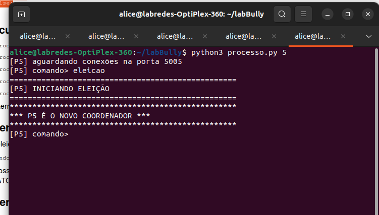

Consulta de status no P2, indicando P5 como coordenador.

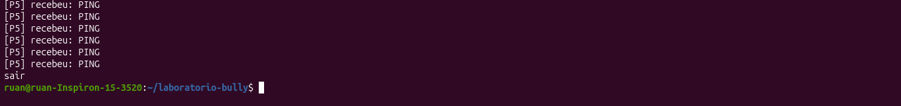

## Falha do coordenador e eleição manual

Encerramento do P5 após a eleição inicial.

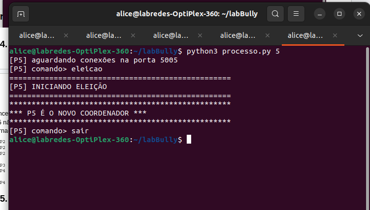

P2 envia ELECTION, recebe OK e recebe o anúncio do P4.

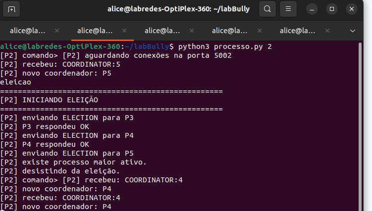

P4 participa das eleições e assume a coordenação.

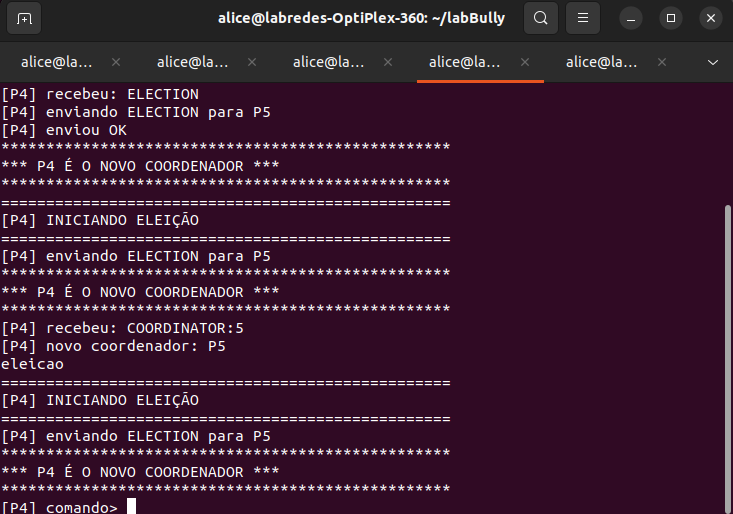

## Recuperação e várias falhas

P5 é reiniciado e inicia uma nova eleição.

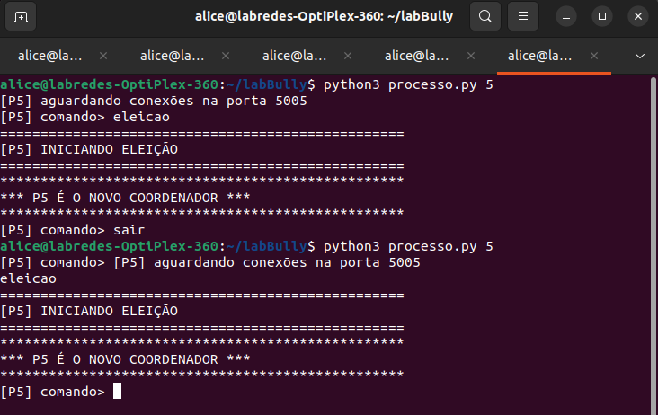

P2 é reiniciado, inicia eleição e recebe COORDINATOR:4.

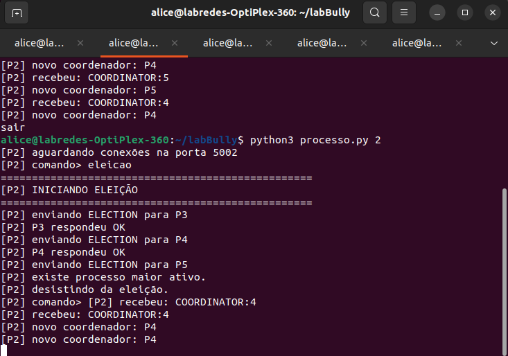

Eleição iniciada no P1, com anúncio de P3 como coordenador.

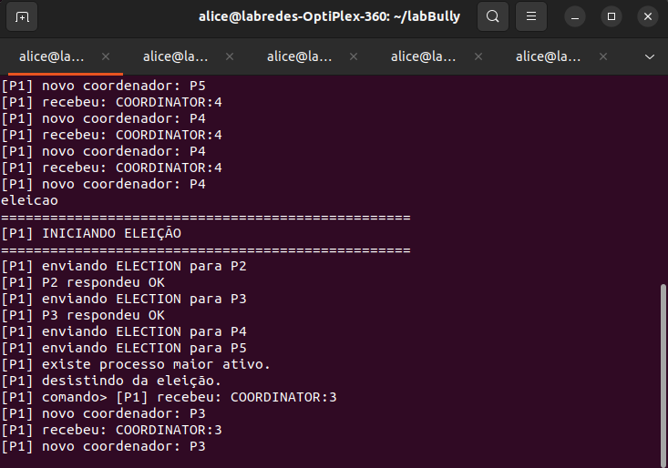

## Detecção automática com PING/PONG

P5 recebe mensagens PING dos demais processos.

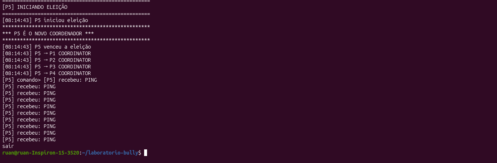

P2 recebe o anúncio de P5 e verifica o coordenador com PING/PONG.

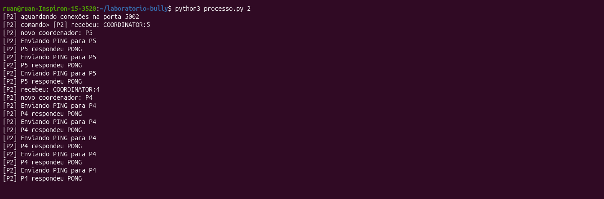

Terminal do P5 durante o atendimento de mensagens PING.

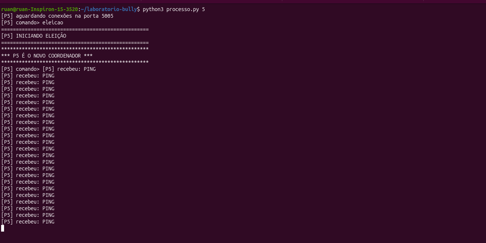

Terminal do P2 durante as verificações PING/PONG.

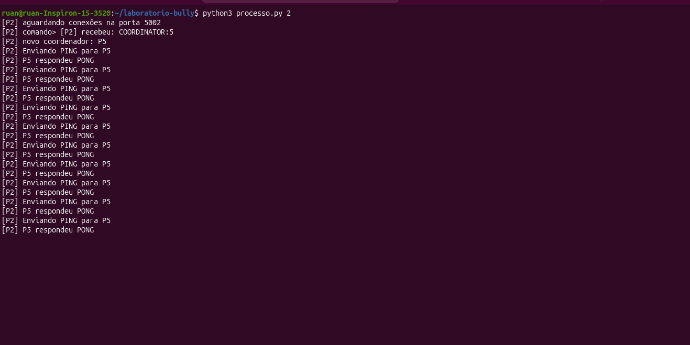

P2 passa a verificar P4 após receber COORDINATOR:4.

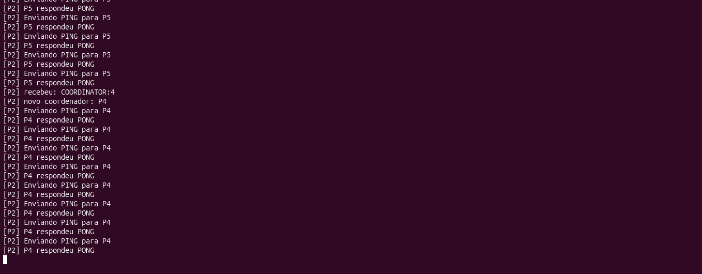

## Logs com horário

P4 detecta a ausência de resposta de P5, inicia eleição automaticamente, vence e registra os anúncios COORDINATOR.

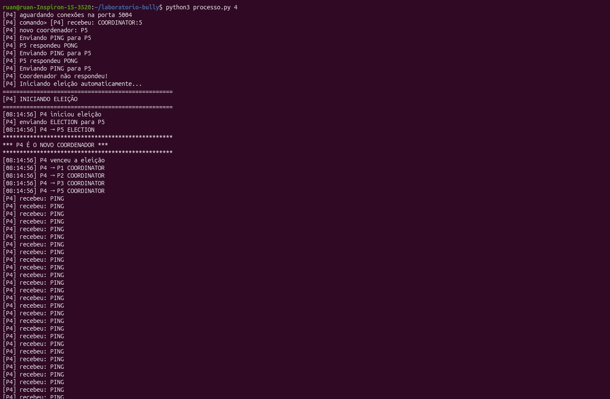

## Diagrama textual automático

P5 apresenta o diagrama da eleição com iniciador, vitória e anúncios COORDINATOR.

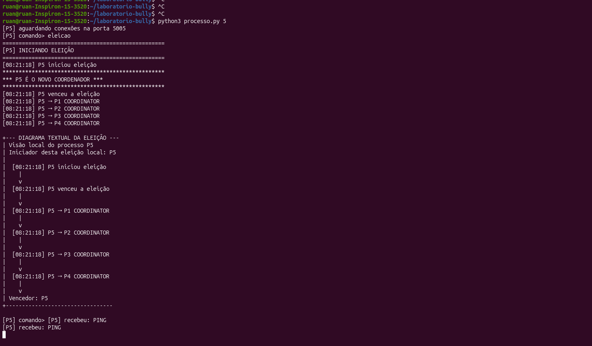

## Capturas da implementação

Tratamento das mensagens PING, ELECTION e COORDINATOR.

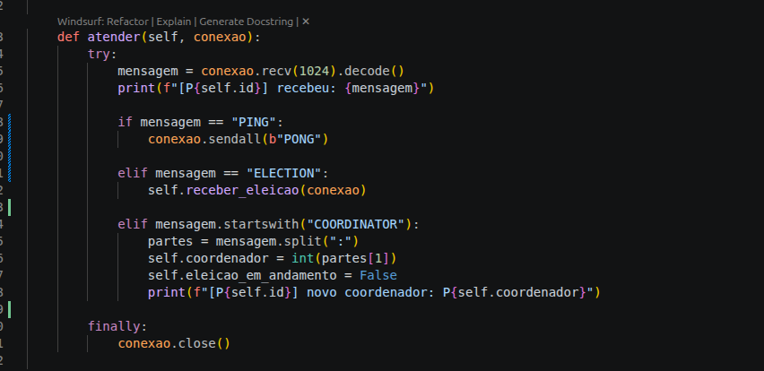

Método de monitoramento do coordenador.

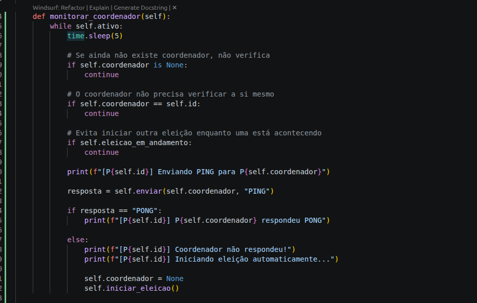
